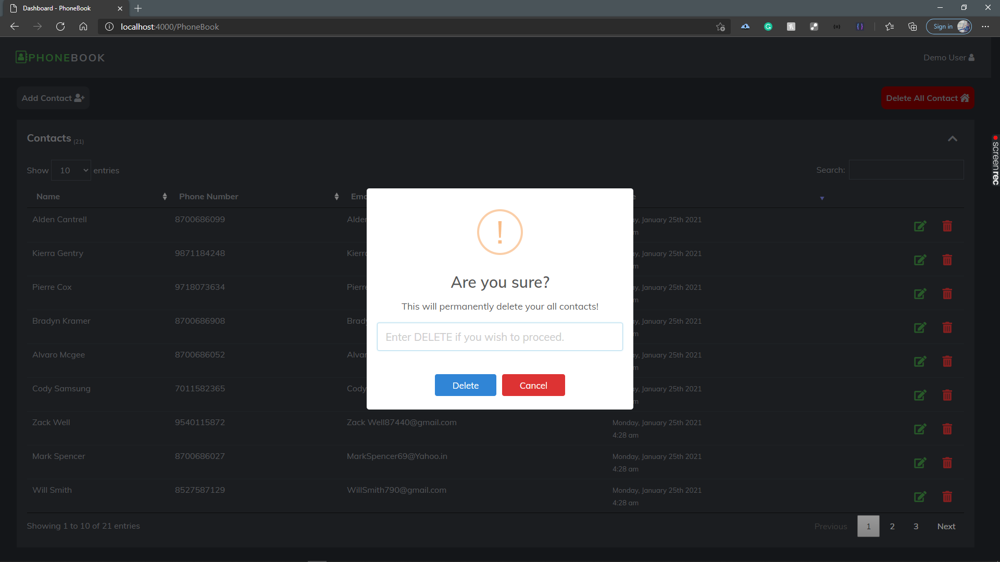

# PhoneBook Service App

### Welcome to PhoneBook Services #

# Application Features.
Capabilities includes:
    
  #### Button Clicks #
  - When clicking on Add Button:
    - Adds a contact to the PhoneBook.
  - When clicking on Edit Button:
    - Hides the row details
    - Shows input for new details
    - Saves the new contact & Shows a success sweatAlert on the right conrner.
  - When clicking on delete Button:
    - A warning pop menu appears on the screen to confirm delete.
    - Deletes the contact when confirm & Shows a success sweatAlert on the right conrner.
  - When clicking on delete all contact Button:
    - A input warning pop menu appears which asks user to Enter DELETE to proceed in the field.
    - Deletes All the contact when enter correctly & Shows a success sweatAlert on the right conrner.
   

# Screenshots
### Add Contact #

### Edit Contact #

### Delete Contact #

### Delete All Contact #

# MANUAL INSTALLATION

- Create new project.
- Copy+Paste all files into project.
- Install all node modules.
- Run command: node app.js
